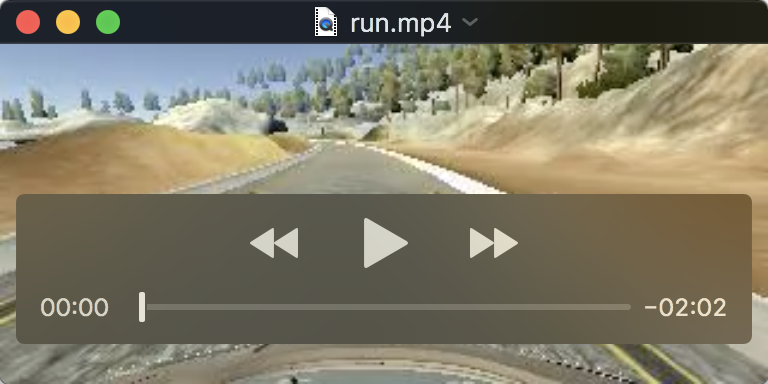

# **Behavioral Cloning** 


[//]: # (Image References)

[image0]: ./examples/cover.png
[image1]: ./examples/cnn-architecture-624x890.png
[image2]: ./examples/Left_Center_Right.png
[image3]: ./examples/flip.png
[image4]: ./examples/poster.png

This is a brief writeup report of Self-Driving Car Engineer P3.


---

**Steps Of This Project**


* Use the [Simulator](https://github.com/udacity/self-driving-car-sim) to collect data of good driving behavior
* Build a convolution neural network in Keras that predicts steering angles from images
* Train and validate the model with a training and validation set
* Test that the model autonomously drives around track one without leaving the road

<Br/>


## Files and Code


#### 1. The project includes the following files:


* `model.py` containing the script to create and train the model
* `drive.py` for driving the car in autonomous mode
* `model.h5` containing a trained convolution neural network 


#### 2. Functional code

Using the **simulator** and **drive.py** file, the car can be driven autonomously around the track by executing 
```sh
python drive.py model.h5
```

#### 3. Model code

The **model.py** file contains the code for training and saving the convolution neural network. Also, the file shows the pipeline, which is used for training and validating the model.

<Br/>

## Data Collection

Before training, the human behavior data on **Track 1** needs to be collected. 

Here are data collection strategies:

> Counter-Clockwise ( the default direction of Track 1 )

* **Center lane driving** × 2 laps
* **Recovery driving from the sides** × 1 lap
* **Focusing on driving smoothly around curves** × 1 lap

> Clockwise

* **Center lane driving smoothly** × 2 laps

After that, the collected data includes a 'driving_log.csv' file with 10762 number of data points and a bunch of camara images in shape of (160,320,3). 

All those are approach 600MB.

<Br/>

## Model Architecture

The model of project is built by **Keras** and referenced some kind of common architectures.

> First Try ( flatten only )

At first, for testing the pipeline, the model consisted of a flatten layer only, which was, not surprisingly, too simple to have a good result. 「model.py lines 77-80」

> Try Again ( LeNet-5 )

The Old friend LeNet is a more powerful network architecture. It helped the simulator vehicle pass through the straight lane smoothly, but failed at curves. 「model.py lines 83-93」 *'Hey, look, there's a car in the river, what happened?'*

> Final Model ( NVIDIA's CNN )

The architecture published by the autonomous vehicle team at NVIDIA is a even more powerful network. It has **5 convolution layers** (with 3x3 or 5x5 filter sizes and depths between 24 and 64) and **4 full-connected layers**.


Some tricks are used on the basis of the NVIDIA's architecture:

* Normalization ( nomalize and 0 mean )

`model.add(Lambda(lambda x: (x / 255.0) - 0.5, input_shape = (160,320,3)))`

* Cropping ( crop useless pixels of image, *the sky, trees, hood,* etc)

`model.add(Cropping2D(cropping = ((70, 20), (0, 0))))`

* Dropout layer ( reduce overfitting )

`model.add(Dropout(0.2))`

* activation functions

`model.add(Convolution2D(***, activation = 'relu'))`

`model.add(Dense(***, activation = 'elu'))` 

The final model makes the simulator vehicle be able to drive autonomously around the Track 1 without leaving the road. 「model.py lines 96-110」

<Br/>

## Training Strategy


#### 1. Training data process

The vehicle has three camaras ( center, left and right ), and the side camara images carries two benifits rather than the center camara images only:

* more training data ( 3 times as much )
* help teach the network how to steer back to the center when drifting off

By taking the actual steering measurement and adding a small correction `0.2` factor to it, those side camara images can be appended to the training data set appropriately. 「model.py lines 30-42」

![alt text][image2]

Simultaneously, data augmentation by flipping the images and steering measurements is also a common trick to expand training data set and help the model generalize better. In the project, the way of augmentation is flipping images by `cv2.flip()` function and taking the opposite sign of the corresponding steering measurements. 「model.py lines 48-53」

![alt text][image3]

#### 2. Loss function and Parameters

Because it's a regression network instead of a classification network, the softmax activation function is not necessary, the model pipeline is compiled by **'MSE'** (mean squared error) loss function and 'adam' optimizer.

At the end of the pipeline, some important parameters are passed into `model.fit()` :

* `validation_split = 0.2` (80% for training, 20% for validating)
* `shuffle = True` (as we know...)
* `nb_epoch = 10` （a good convergence）


#### 3. Training and Testing

The training process takes about 9 minutes on GTX970.

```
Train on 51657 samples, validate on 12915 samples
physical GPU (device: 0, name: GeForce GTX 970, pci bus id: 0000:01:00.0, compute capability: 5.2)
```
Benifiting from the NVIDIA's architecture, the model has a very fast convergence. After 10 epochs, the training loss is **0.87%** and the validating loss is **0.96%** .

```
Epoch 1/10
51657/51657 [==========] - 52s - loss: 0.0155 - val_loss: 0.0107
Epoch 2/10
51657/51657 [==========] - 48s - loss: 0.0105 - val_loss: 0.0103  
Epoch 3/10
51657/51657 [==========] - 48s - loss: 0.0102 - val_loss: 0.0100 
Epoch 4/10
51657/51657 [==========] - 48s - loss: 0.0100 - val_loss: 0.0096  
Epoch 5/10
51657/51657 [==========] - 48s - loss: 0.0097 - val_loss: 0.0098          
Epoch 6/10
51657/51657 [==========] - 48s - loss: 0.0095 - val_loss: 0.0095                  
Epoch 7/10
51657/51657 [==========] - 48s - loss: 0.0092 - val_loss: 0.0096
Epoch 8/10
51657/51657 [==========] - 48s - loss: 0.0091 - val_loss: 0.0092    
Epoch 9/10
51657/51657 [==========] - 48s - loss: 0.0088 - val_loss: 0.0093 
Epoch 10/10
51657/51657 [==========] - 48s - loss: 0.0087 - val_loss: 0.0096
```

Testing result is good on Track 1. After starting `drive.py`, the simulator vehicle can drive autonomously around in speed of 9 mph without leaving the road, even curves.

```
python drive.py model.h5 run
python video.py run
```
BTW, the `video.py` file can help creating video recording when in autonomous mode. 

```
Creating video run, FPS=60
[MoviePy] >>>> Building video run.mp4
[MoviePy] Writing video run.mp4
100%|████████████████| 7334/7334 [00:30<00:00, 243.14it/s]
[MoviePy] Done.
[MoviePy] >>>> Video ready: run.mp4 
```

Here is a [video](https://github.com/MarsBase7/Behavioral-Cloning/blob/master/examples/run.mp4) in the '/examples' that the simulator vehicle drives on Track 1 autonomously, recording by center camara.

<!--![alt text][image4]<!---->


## Experience Summary

* Training data is very important, the simulator vehicle can not drive much better than your behavior.
* Dropout is useful but not necessary.
* ELU is a little better than ReLU in this model.
* The number of epochs is more effective in 5 ~ 10.
* Keras model.fit() always shuffles training data after data split, so you may need create shuffle process yourself beforce fit().